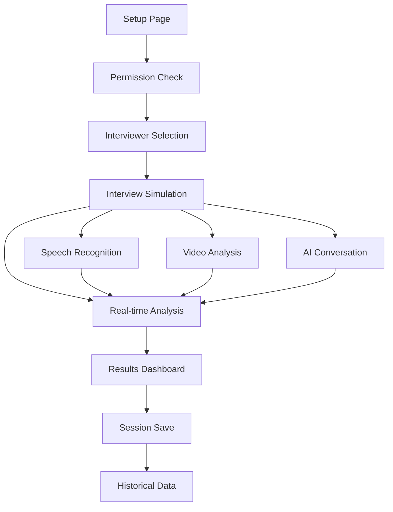

# Production Readiness Requirements - Closed Door Interview Feature

## 1. Product Overview
A comprehensive AI-powered interview simulation platform featuring real-time speech recognition, video analysis, and intelligent feedback systems. The closed-door interview feature provides users with realistic interview experiences through advanced AI interviewers, performance tracking, and detailed analytics.

The platform addresses the critical need for accessible, high-quality interview preparation by leveraging Google AI (Gemini 2.5 Flash) for intelligent conversation and Firebase services for scalable data management, targeting job seekers and professionals seeking to improve their interview skills.

## 2. Core Features

### 2.1 User Roles
| Role | Registration Method | Core Permissions |
|------|---------------------|------------------|
| Candidate | Email/Google OAuth | Can access all interview features, view analytics, save sessions |
| Guest User | No registration | Limited access to demo features, no data persistence |

### 2.2 Feature Module
Our closed-door interview platform consists of the following main pages:
1. **Setup Page**: System requirements check, camera/microphone permissions, feature overview
2. **Interviewer Selection Page**: AI interviewer profiles, difficulty selection, random assignment
3. **Interview Simulation Page**: Real-time video recording, speech recognition, AI conversation, performance tracking
4. **Results Dashboard Page**: Comprehensive analytics, performance metrics, feedback reports, session history

### 2.3 Page Details
| Page Name | Module Name | Feature description |
|-----------|-------------|---------------------|
| Setup Page | System Check | Verify camera/microphone access, display system requirements, feature introduction |
| Setup Page | Permission Manager | Request and validate media permissions, troubleshoot access issues |
| Interviewer Selection | AI Profiles | Display interviewer personalities, specialties, difficulty levels, background information |
| Interviewer Selection | Selection Logic | Random interviewer assignment, manual selection, difficulty matching |
| Interview Simulation | Real-time Recording | Continuous video/audio capture, stream processing, quality monitoring |
| Interview Simulation | Speech Recognition | Live transcription, confidence scoring, interim results handling |
| Interview Simulation | AI Conversation | Dynamic question generation, contextual responses, follow-up questions |
| Interview Simulation | Performance Tracking | Eye contact analysis, speech metrics, confidence scoring, body language assessment |
| Results Dashboard | Analytics Display | Performance visualization, metric breakdowns, trend analysis |
| Results Dashboard | Feedback System | Strengths identification, improvement recommendations, actionable insights |
| Results Dashboard | Session Management | Save/load sessions, export reports, share results |

## 3. Core Process

**Main User Flow:**
1. User accesses setup page and grants camera/microphone permissions
2. System validates requirements and displays feature overview
3. User proceeds to interviewer selection and chooses AI personality
4. Interview simulation begins with real-time recording and AI interaction
5. Performance metrics are tracked continuously during the session
6. Upon completion, comprehensive analytics and feedback are generated
7. User can review results, save session, and access historical data

## 4. User Interface Design

### 4.1 Design Style
- **Primary Colors**: Blue (#3B82F6), Green (#10B981), Purple (#8B5CF6)
- **Secondary Colors**: Gray (#6B7280), Muted backgrounds (#F9FAFB)
- **Button Style**: Rounded corners (8px), subtle shadows, hover animations
- **Font**: Inter font family, 14px base size, responsive scaling
- **Layout Style**: Card-based design, clean spacing, mobile-first responsive
- **Icons**: Lucide React icons, consistent sizing, contextual colors

### 4.2 Page Design Overview
| Page Name | Module Name | UI Elements |
|-----------|-------------|-------------|
| Setup Page | System Check | Clean cards with status indicators, progress bars, animated icons |
| Setup Page | Feature Overview | Grid layout, hover effects, informational cards with gradients |
| Interviewer Selection | AI Profiles | Avatar cards, specialty badges, difficulty indicators, smooth transitions |
| Interview Simulation | Recording Interface | Full-screen video, floating controls, real-time metrics overlay |
| Interview Simulation | Transcript Display | Scrollable area, speaker identification, confidence indicators |
| Results Dashboard | Analytics Charts | Interactive visualizations, progress rings, metric cards |
| Results Dashboard | Feedback Cards | Categorized sections, action buttons, export options |

### 4.3 Responsiveness
Desktop-first design with comprehensive mobile adaptation. Touch-optimized controls for mobile devices, responsive grid layouts, and adaptive font sizing. Optimized for tablets with landscape orientation support for interview sessions.

## 5. Production Requirements

### 5.1 Performance Optimization
- **Code Splitting**: Lazy load interview components, dynamic imports for heavy features
- **Bundle Size**: Target <500KB initial bundle, optimize dependencies
- **Real-time Processing**: WebRTC optimization, efficient audio/video handling
- **Memory Management**: Proper cleanup of media streams, garbage collection optimization

### 5.2 Reliability & Error Handling
- **Graceful Degradation**: Fallback for unsupported browsers, offline capabilities
- **Error Boundaries**: Component-level error handling, user-friendly error messages
- **Session Recovery**: Auto-save functionality, resume interrupted sessions
- **API Resilience**: Retry mechanisms, timeout handling, rate limit management

### 5.3 Security & Privacy
- **Data Protection**: Encrypted storage, secure transmission, GDPR compliance
- **Media Security**: Secure video/audio handling, no unauthorized access
- **API Security**: Rate limiting, authentication, input validation
- **User Privacy**: Clear consent mechanisms, data retention policies

### 5.4 Monitoring & Analytics
- **Performance Monitoring**: Real-time metrics, error tracking, user analytics
- **Usage Analytics**: Feature adoption, session completion rates, user engagement
- **System Health**: API response times, error rates, resource utilization
- **User Experience**: Core Web Vitals, interaction tracking, conversion funnels

### 5.5 Scalability Considerations
- **Auto-scaling**: Vercel edge functions, dynamic resource allocation
- **Database Optimization**: Efficient queries, connection pooling, caching strategies
- **CDN Integration**: Asset optimization, global distribution, edge caching
- **Load Balancing**: Geographic distribution, failover mechanisms