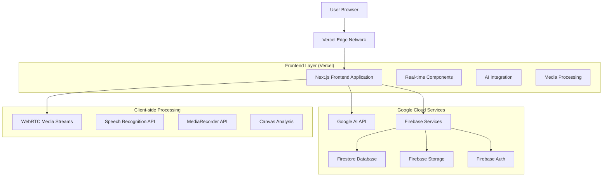
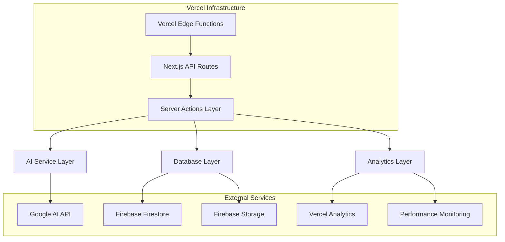
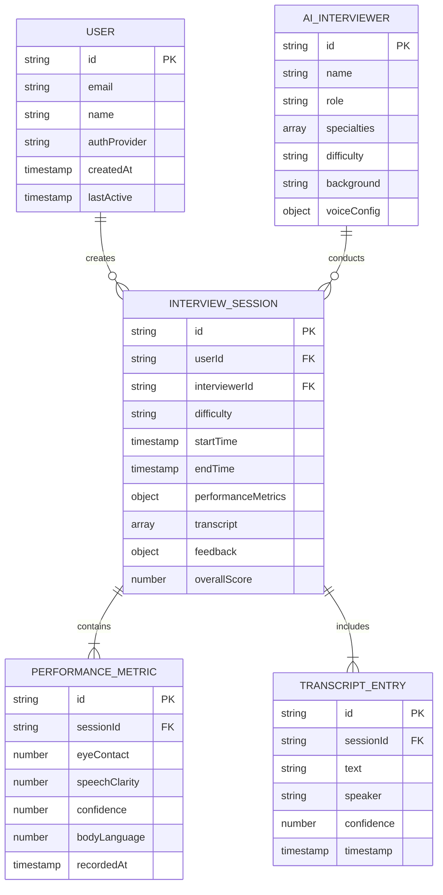

# Technical Architecture - Production Deployment

## 1. Architecture Design



## 2. Technology Description

- **Frontend**: React@18 + Next.js@15.3.3 + TypeScript + Tailwind CSS@3.4.1
- **AI Services**: Google AI (Gemini 2.5 Flash) via Genkit@1.14.1
- **Backend Services**: Firebase (Auth, Firestore, Storage, Analytics)
- **Deployment**: Vercel Edge Network with Firebase App Hosting
- **Real-time Processing**: WebRTC, Web Speech API, MediaRecorder API
- **State Management**: React Hooks + Context API
- **UI Components**: Radix UI + shadcn/ui + Lucide React icons

## 3. Route Definitions

| Route | Purpose |
|-------|---------|
| /closed-door-interview | Main interview application entry point |
| /closed-door-interview/setup | System requirements and permissions setup |
| /closed-door-interview/selection | AI interviewer selection interface |
| /closed-door-interview/session | Active interview simulation environment |
| /closed-door-interview/results | Post-interview analytics and feedback |
| /api/interview/start | Initialize interview session (Server Action) |
| /api/interview/analyze | Process performance metrics (Server Action) |
| /api/interview/save | Persist session data (Server Action) |

## 4. API Definitions

### 4.1 Core API

**Interview Session Management**
```
POST /api/interview/start
```

Request:
| Param Name | Param Type | isRequired | Description |
|------------|------------|------------|-------------|
| interviewerId | string | true | Selected AI interviewer ID |
| difficulty | string | true | Interview difficulty level (easy/medium/hard) |
| userId | string | false | User ID for authenticated sessions |

Response:
| Param Name | Param Type | Description |
|------------|------------|-------------|
| sessionId | string | Unique session identifier |
| interviewer | object | AI interviewer configuration |
| status | boolean | Operation success status |

Example:
```json
{
  "interviewerId": "sarah_chen",
  "difficulty": "medium",
  "userId": "user_123"
}
```

**Performance Analysis**
```
POST /api/interview/analyze
```

Request:
| Param Name | Param Type | isRequired | Description |
|------------|------------|------------|-------------|
| sessionId | string | true | Interview session ID |
| metrics | object | true | Performance metrics data |
| transcript | array | true | Conversation transcript |

Response:
| Param Name | Param Type | Description |
|------------|------------|-------------|
| analysis | object | Comprehensive performance analysis |
| feedback | object | Structured feedback and recommendations |
| score | number | Overall performance score (0-100) |

**Session Persistence**
```
POST /api/interview/save
```

Request:
| Param Name | Param Type | isRequired | Description |
|------------|------------|------------|-------------|
| sessionData | object | true | Complete session information |
| userId | string | false | User ID for data association |

Response:
| Param Name | Param Type | Description |
|------------|------------|-------------|
| saved | boolean | Save operation status |
| sessionId | string | Saved session identifier |

## 5. Server Architecture Diagram



## 6. Data Model

### 6.1 Data Model Definition



### 6.2 Data Definition Language

**Users Collection (Firestore)**
```javascript
// Collection: users
{
  id: "user_123",
  email: "user@example.com",
  name: "John Doe",
  authProvider: "google",
  createdAt: Timestamp,
  lastActive: Timestamp,
  preferences: {
    notifications: true,
    dataRetention: 30 // days
  }
}

// Firestore Security Rules
rules_version = '2';
service cloud.firestore {
  match /databases/{database}/documents {
    match /users/{userId} {
      allow read, write: if request.auth != null && request.auth.uid == userId;
    }
    
    match /interviewSessions/{sessionId} {
      allow read, write: if request.auth != null && 
        request.auth.uid == resource.data.userId;
    }
  }
}
```

**Interview Sessions Collection (Firestore)**
```javascript
// Collection: interviewSessions
{
  id: "session_456",
  userId: "user_123",
  interviewerId: "sarah_chen",
  difficulty: "medium",
  startTime: Timestamp,
  endTime: Timestamp,
  performanceMetrics: {
    eyeContact: 85,
    speechClarity: 78,
    confidence: 82,
    bodyLanguage: 79,
    overallScore: 81
  },
  transcript: [
    {
      id: "transcript_1",
      text: "Tell me about yourself",
      speaker: "interviewer",
      confidence: 0.95,
      timestamp: Timestamp
    }
  ],
  feedback: {
    strengths: ["Clear communication", "Good eye contact"],
    improvements: ["Reduce filler words", "Improve posture"],
    recommendations: ["Practice technical questions", "Mock interviews"]
  },
  metadata: {
    browserInfo: "Chrome 120",
    deviceType: "desktop",
    sessionDuration: 1800 // seconds
  }
}

// Firestore Indexes
// Composite index: userId, startTime (descending)
// Single field index: overallScore (descending)
// Single field index: difficulty
```

**AI Interviewers Configuration (Firestore)**
```javascript
// Collection: aiInterviewers
{
  id: "sarah_chen",
  name: "Sarah Chen",
  role: "Senior Software Engineer",
  company: "Tech Innovators Inc.",
  specialties: ["Frontend Development", "React", "System Design"],
  difficulty: "medium",
  background: "Senior engineer with 8+ years experience in scalable web applications",
  questionTypes: ["technical", "behavioral", "problem_solving"],
  voiceConfig: {
    voiceId: "female_professional",
    rate: 1.0,
    pitch: 1.0,
    volume: 0.8,
    lang: "en-US"
  },
  avatar: "https://firebasestorage.googleapis.com/avatars/sarah_chen.jpg",
  isActive: true,
  createdAt: Timestamp,
  updatedAt: Timestamp
}

// Initial Data Seeding
const initialInterviewers = [
  {
    id: "sarah_chen",
    name: "Sarah Chen",
    role: "Senior Software Engineer",
    // ... rest of configuration
  },
  {
    id: "marcus_rodriguez",
    name: "Marcus Rodriguez",
    role: "Engineering Manager",
    // ... rest of configuration
  }
];
```

**Performance Analytics (Firestore)**
```javascript
// Collection: performanceAnalytics
{
  id: "analytics_789",
  sessionId: "session_456",
  userId: "user_123",
  metrics: {
    speechMetrics: {
      wordsPerMinute: 145,
      pauseFrequency: 12,
      fillerWords: 8,
      clarity: 0.85,
      volume: 0.7
    },
    bodyLanguageMetrics: {
      eyeContact: 0.82,
      posture: 0.78,
      facialExpression: 0.85,
      handGestures: 0.75
    },
    technicalMetrics: {
      responseTime: 3.2, // seconds
      answerCompleteness: 0.88,
      relevance: 0.92,
      technicalAccuracy: 0.85
    }
  },
  aggregatedScore: 81,
  recordedAt: Timestamp,
  processingTime: 245 // milliseconds
}
```