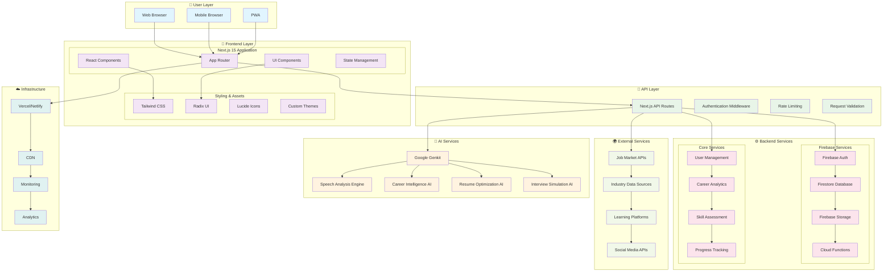
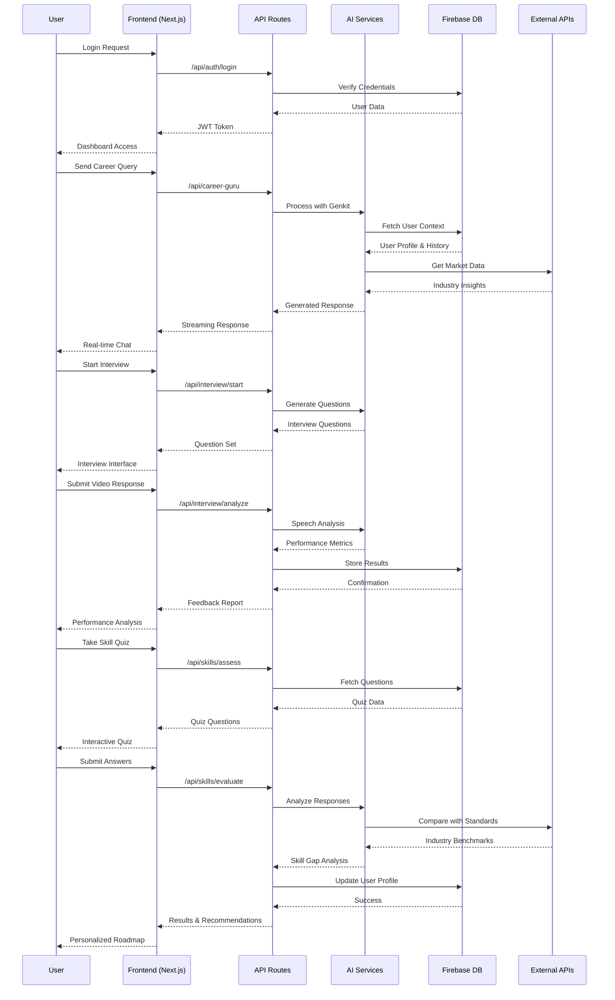
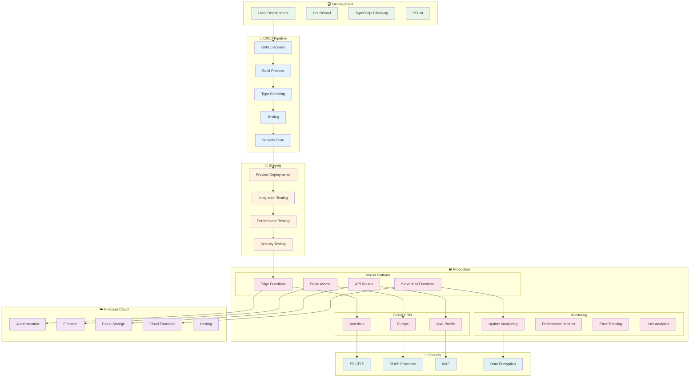
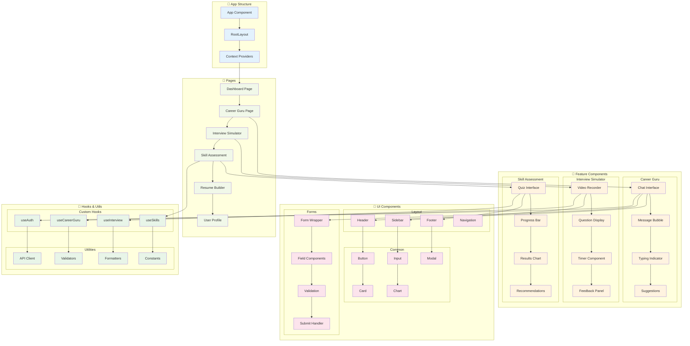

# 🏗️ SkillVoyager Architecture Diagrams

## 📋 Overview

This document contains comprehensive architecture diagrams for the SkillVoyager platform, showcasing both high-level system architecture and detailed technical implementation.

---

## 🌐 High-Level System Architecture



---

## 🔧 Detailed Technical Architecture

```mermaid
graph TB
    %% Client Side
    subgraph "💻 Client Side (Browser)"
        subgraph "React Application"
            C1[App Component]
            C2[Dashboard Page]
            C3[Career Guru Chat]
            C4[Interview Simulator]
            C5[Skill Assessment]
            C6[Resume Builder]
        end
        
        subgraph "State Management"
            S1[React Context]
            S2[Custom Hooks]
            S3[Local Storage]
            S4[Session Storage]
        end
        
        subgraph "UI Framework"
            UI1[Tailwind CSS]
            UI2[Radix Primitives]
            UI3[shadcn/ui]
            UI4[Framer Motion]
        end
    end

    %% Server Side
    subgraph "🖥️ Server Side (Next.js)"
        subgraph "App Router"
            AR1[Layout Components]
            AR2[Page Components]
            AR3[Loading States]
            AR4[Error Boundaries]
        end
        
        subgraph "API Routes"
            API1[/api/auth]
            API2[/api/career-guru]
            API3[/api/interview]
            API4[/api/skills]
            API5[/api/resume]
            API6[/api/analytics]
        end
        
        subgraph "Middleware"
            MW1[Authentication]
            MW2[Rate Limiting]
            MW3[CORS]
            MW4[Request Logging]
        end
    end

    %% AI Processing Layer
    subgraph "🧠 AI Processing Layer"
        subgraph "Google Genkit Integration"
            GK1[AI Model Manager]
            GK2[Prompt Engineering]
            GK3[Response Processing]
            GK4[Context Management]
        end
        
        subgraph "Specialized AI Services"
            AI1[Speech Analysis]
            AI2[Resume Optimization]
            AI3[Career Matching]
            AI4[Skill Gap Analysis]
            AI5[Interview Feedback]
        end
        
        subgraph "AI Data Pipeline"
            DP1[Data Preprocessing]
            DP2[Feature Extraction]
            DP3[Model Inference]
            DP4[Post-processing]
        end
    end

    %% Data Layer
    subgraph "💾 Data Layer"
        subgraph "Firebase Firestore"
            FS1[Users Collection]
            FS2[Careers Collection]
            FS3[Skills Collection]
            FS4[Interviews Collection]
            FS5[Analytics Collection]
        end
        
        subgraph "Firebase Storage"
            ST1[User Profiles]
            ST2[Resume Files]
            ST3[Interview Recordings]
            ST4[Asset Files]
        end
        
        subgraph "Caching Layer"
            CH1[Redis Cache]
            CH2[Browser Cache]
            CH3[CDN Cache]
            CH4[API Response Cache]
        end
    end

    %% Authentication & Security
    subgraph "🔐 Authentication & Security"
        subgraph "Firebase Auth"
            AUTH1[Email/Password]
            AUTH2[Google OAuth]
            AUTH3[GitHub OAuth]
            AUTH4[JWT Tokens]
        end
        
        subgraph "Security Measures"
            SEC1[HTTPS Enforcement]
            SEC2[Input Validation]
            SEC3[XSS Protection]
            SEC4[CSRF Protection]
        end
    end

    %% External Integrations
    subgraph "🌐 External Integrations"
        EXT1[Job Boards APIs]
        EXT2[LinkedIn API]
        EXT3[GitHub API]
        EXT4[Industry Data APIs]
        EXT5[Learning Platform APIs]
    end

    %% Monitoring & Analytics
    subgraph "📊 Monitoring & Analytics"
        MON1[Vercel Analytics]
        MON2[Google Analytics]
        MON3[Error Tracking]
        MON4[Performance Monitoring]
        MON5[User Behavior Analytics]
    end

    %% Data Flow Connections
    C1 --> S1
    C2 --> API1
    C3 --> API2
    C4 --> API3
    C5 --> API4
    C6 --> API5
    
    API2 --> GK1
    API3 --> AI1
    API4 --> AI4
    API5 --> AI2
    API6 --> MON1
    
    GK1 --> DP1
    AI1 --> DP2
    AI2 --> DP3
    AI4 --> DP4
    
    API1 --> AUTH1
    API2 --> FS1
    API3 --> FS4
    API4 --> FS3
    API5 --> ST2
    
    AUTH1 --> SEC1
    FS1 --> CH1
    ST1 --> CH3
    
    API6 --> EXT1
    EXT1 --> EXT2
    EXT2 --> EXT3
    
    MON1 --> MON2
    MON2 --> MON3
    MON3 --> MON4

    %% Styling
    classDef clientSide fill:#e3f2fd
    classDef serverSide fill:#f1f8e9
    classDef aiLayer fill:#fff8e1
    classDef dataLayer fill:#fce4ec
    classDef authLayer fill:#e8f5e8
    classDef externalLayer fill:#f3e5f5
    classDef monitoringLayer fill:#e0f2f1
    
    class C1,C2,C3,C4,C5,C6,S1,S2,S3,S4,UI1,UI2,UI3,UI4 clientSide
    class AR1,AR2,AR3,AR4,API1,API2,API3,API4,API5,API6,MW1,MW2,MW3,MW4 serverSide
    class GK1,GK2,GK3,GK4,AI1,AI2,AI3,AI4,AI5,DP1,DP2,DP3,DP4 aiLayer
    class FS1,FS2,FS3,FS4,FS5,ST1,ST2,ST3,ST4,CH1,CH2,CH3,CH4 dataLayer
    class AUTH1,AUTH2,AUTH3,AUTH4,SEC1,SEC2,SEC3,SEC4 authLayer
    class EXT1,EXT2,EXT3,EXT4,EXT5 externalLayer
    class MON1,MON2,MON3,MON4,MON5 monitoringLayer
```

---

## 🔄 Data Flow Architecture



---

## 🚀 Deployment Architecture



---

## 📱 Component Architecture



---

## 🔍 Key Architecture Highlights

### 🎯 **Design Principles**
- **Modular Architecture**: Clean separation of concerns
- **Scalable Components**: Reusable and maintainable code
- **Performance First**: Optimized for speed and efficiency
- **Security by Design**: Built-in security measures
- **User-Centric**: Focused on user experience

### 🚀 **Technology Advantages**
- **Next.js 15**: Latest features with App Router
- **TypeScript**: Type safety and better developer experience
- **Firebase**: Scalable backend infrastructure
- **Google Genkit**: Advanced AI capabilities
- **Vercel**: Optimized deployment platform

### 📊 **Performance Features**
- **Server-Side Rendering**: Fast initial page loads
- **Static Generation**: Optimized static content
- **Edge Functions**: Global performance optimization
- **Caching Strategy**: Multi-layer caching system
- **Code Splitting**: Efficient bundle loading

### 🔐 **Security Measures**
- **Authentication**: Multi-provider auth system
- **Authorization**: Role-based access control
- **Data Protection**: Encrypted data transmission
- **Input Validation**: Comprehensive validation system
- **Security Headers**: Protection against common attacks

---

*This architecture ensures SkillVoyager delivers a robust, scalable, and user-friendly career guidance platform.*