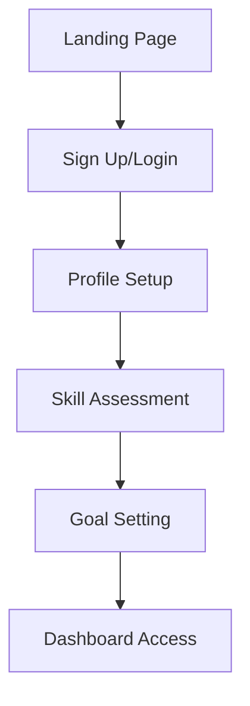
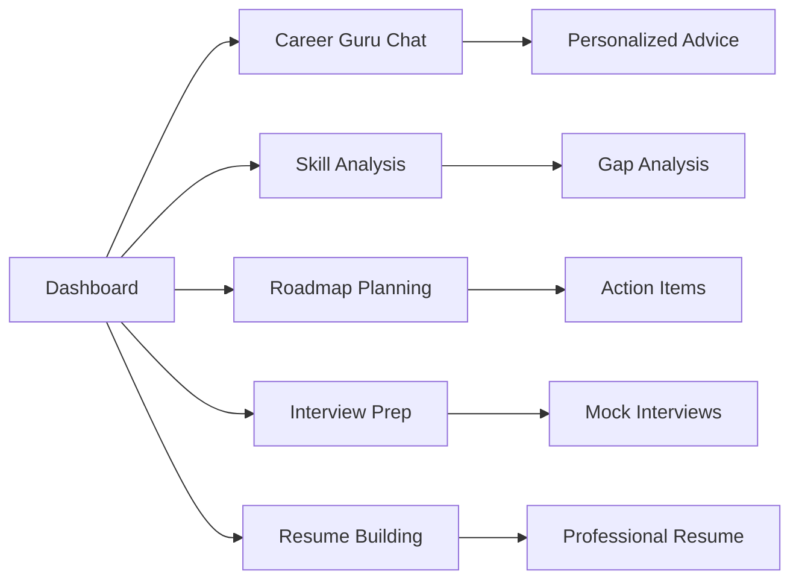
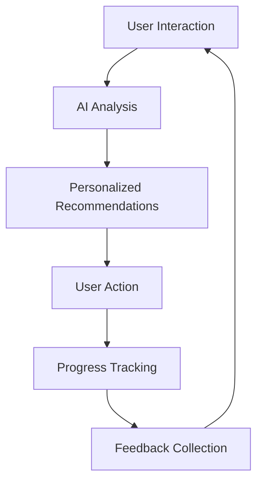

# 🚀 SkillVoyager: Your AI-Powered Career Companion

<div align="center">


**Navigate Your Professional Journey with Confidence**

[](https://github.com)
[](https://nextjs.org/)
[](https://www.typescriptlang.org/)
[](https://tailwindcss.com/)
[](https://firebase.google.com/)

</div>

---

## 📋 Table of Contents

1. [🎯 Executive Summary](#-executive-summary)
2. [✨ Core Features](#-core-features)
3. [🎨 Design Philosophy](#-design-philosophy)
4. [🔄 User Workflow](#-user-workflow)
5. [🏗️ Technical Architecture](#️-technical-architecture)
6. [💡 Innovation & Importance](#-innovation--importance)
7. [📊 Market Impact](#-market-impact)
8. [🚀 Deployment & Scalability](#-deployment--scalability)
9. [👥 Team & Credits](#-team--credits)

---

## 🎯 Executive Summary

**SkillVoyager** is a revolutionary AI-powered career guidance platform that transforms how professionals navigate their career journeys. Built with cutting-edge technology and designed with user experience at its core, SkillVoyager provides personalized career insights, skill gap analysis, and actionable roadmaps to help users achieve their professional goals.

### 🌟 Key Highlights
- **AI-Powered Intelligence**: Advanced AI algorithms provide personalized career recommendations
- **Comprehensive Career Tools**: From resume building to interview simulation
- **Modern Tech Stack**: Built with Next.js 15, TypeScript, and Firebase
- **User-Centric Design**: Intuitive interface with accessibility-first approach
- **Scalable Architecture**: Production-ready with deployment optimization

---

## ✨ Core Features

### 🤖 **AI Career Guru**
- **Intelligent Chat Interface**: Real-time career guidance with streaming responses
- **Personalized Recommendations**: Tailored advice based on user profile and goals
- **Multi-Modal Support**: Text, voice, and visual interaction capabilities
- **Context-Aware Responses**: Maintains conversation history for better insights

### 📊 **Skill Gap Analysis**
- **Comprehensive Assessment**: Evaluate current skills against industry standards
- **Visual Analytics**: Interactive charts and progress tracking
- **Learning Pathways**: Customized skill development recommendations
- **Industry Benchmarking**: Compare skills with market demands

### 🎯 **Personalized Roadmaps**
- **Career Path Visualization**: Interactive roadmap with milestones
- **Goal Setting & Tracking**: Set and monitor career objectives
- **Timeline Management**: Realistic timelines with progress indicators
- **Achievement System**: Gamified progress with badges and rewards

### 🎤 **Interview Simulator**
- **AI-Powered Mock Interviews**: Realistic interview scenarios
- **Real-time Feedback**: Instant analysis of responses and performance
- **Industry-Specific Questions**: Tailored questions for different roles
- **Performance Analytics**: Detailed reports with improvement suggestions

### 📄 **Smart Resume Builder**
- **AI-Enhanced Content**: Intelligent suggestions for resume improvement
- **Multiple Templates**: Professional templates for different industries
- **ATS Optimization**: Ensure compatibility with Applicant Tracking Systems
- **Export Options**: PDF generation with professional formatting

### 🎮 **Gamified Learning**
- **Interactive Quizzes**: Skill assessment through engaging quizzes
- **Daily Challenges**: Keep users engaged with daily career tasks
- **Achievement System**: Unlock badges and track progress
- **Leaderboards**: Competitive elements to motivate learning

---

## 🎨 Design Philosophy

### 🌈 **Visual Identity**
- **Modern Gradient Design**: Beautiful blue-to-purple gradients throughout
- **Consistent Branding**: Cohesive visual language across all components
- **Professional Aesthetics**: Clean, modern interface suitable for professionals
- **Responsive Design**: Seamless experience across all devices

### 🎯 **User Experience Principles**

#### **1. Accessibility First**
- WCAG 2.1 AA compliance
- Keyboard navigation support
- Screen reader compatibility
- High contrast ratios

#### **2. Performance Optimized**
- Fast loading times with optimized assets
- Efficient state management
- Lazy loading for better performance
- Progressive Web App capabilities

#### **3. Intuitive Navigation**
- Clear information architecture
- Consistent navigation patterns
- Breadcrumb navigation
- Smart search functionality

#### **4. Mobile-First Approach**
- Responsive design for all screen sizes
- Touch-friendly interface elements
- Optimized mobile interactions
- Progressive enhancement

---

## 🔄 User Workflow

### 📝 **1. Onboarding Journey**


### 🎯 **2. Core User Flow**


### 🔄 **3. Continuous Improvement Loop**


---

## 🏗️ Technical Architecture

### 🛠️ **Technology Stack**

#### **Frontend**
- **Framework**: Next.js 15.3.3 with App Router
- **Language**: TypeScript for type safety
- **Styling**: Tailwind CSS with custom design system
- **UI Components**: Radix UI with shadcn/ui
- **State Management**: React Context + Custom hooks
- **Icons**: Lucide React for consistent iconography

#### **Backend & Services**
- **Authentication**: Firebase Auth with custom providers
- **AI Integration**: Google Genkit for AI capabilities
- **Database**: Firebase Firestore for real-time data
- **File Storage**: Firebase Storage for user assets
- **API Routes**: Next.js API routes for server-side logic

#### **Development & Deployment**
- **Build Tool**: Turbopack for fast development
- **Type Checking**: TypeScript strict mode
- **Linting**: ESLint with custom rules
- **Deployment**: Vercel/Netlify ready configuration
- **Performance**: Optimized for Core Web Vitals

### 🏛️ **Architecture Patterns**

#### **Component Architecture**
```
src/
├── components/
│   ├── ui/           # Reusable UI components
│   ├── layout/       # Layout components
│   ├── dashboard/    # Dashboard-specific components
│   └── feature/      # Feature-specific components
├── app/              # Next.js App Router pages
├── hooks/            # Custom React hooks
├── contexts/         # React Context providers
├── lib/              # Utility functions and configurations
└── types/            # TypeScript type definitions
```

#### **Data Flow Architecture**
- **Unidirectional Data Flow**: React's one-way data binding
- **Context-Based State**: Global state management with React Context
- **Custom Hooks**: Reusable logic encapsulation
- **API Layer**: Centralized API communication

---

## 💡 Innovation & Importance

### 🚀 **Revolutionary Features**

#### **1. AI-Powered Career Intelligence**
- **Advanced NLP**: Understanding context and nuance in career queries
- **Predictive Analytics**: Forecasting career trends and opportunities
- **Personalization Engine**: Learning from user interactions for better recommendations
- **Real-time Adaptation**: Continuously improving based on user feedback

#### **2. Comprehensive Career Ecosystem**
- **360° Career View**: Complete career management in one platform
- **Industry Integration**: Real-world job market data integration
- **Skill Mapping**: Advanced algorithms for skill gap identification
- **Career Trajectory Modeling**: Predictive career path analysis

#### **3. Gamified Professional Development**
- **Engagement Psychology**: Using game mechanics for motivation
- **Progress Visualization**: Clear progress indicators and achievements
- **Social Learning**: Community features for peer learning
- **Habit Formation**: Daily challenges to build career development habits

### 🌍 **Market Importance**

#### **Addressing Critical Pain Points**
1. **Career Confusion**: 70% of professionals feel lost in their career journey
2. **Skill Gaps**: Rapid technology changes create constant skill gaps
3. **Interview Anxiety**: Poor interview preparation leads to missed opportunities
4. **Resume Optimization**: Most resumes fail to pass ATS systems
5. **Lack of Guidance**: Limited access to quality career counseling

#### **Market Opportunity**
- **Global Career Services Market**: $15.7 billion by 2025
- **AI in HR Market**: $3.6 billion by 2024
- **Online Learning Market**: $350 billion by 2025
- **Professional Development**: $366 billion market size

---

## 📊 Market Impact

### 🎯 **Target Audience**

#### **Primary Users**
- **Early Career Professionals** (22-30 years): Seeking career direction
- **Mid-Career Switchers** (30-45 years): Looking for career transitions
- **Students & Graduates** (18-25 years): Preparing for job market entry
- **Upskilling Professionals** (25-50 years): Adapting to industry changes

#### **Secondary Users**
- **HR Professionals**: Using insights for talent development
- **Career Counselors**: Leveraging AI for better guidance
- **Educational Institutions**: Integrating career guidance tools
- **Corporate Training**: Employee development programs

### 📈 **Expected Impact**

#### **User Benefits**
- **50% Faster Career Decisions**: AI-powered insights reduce decision time
- **40% Better Interview Performance**: Comprehensive preparation tools
- **60% Improved Resume Success**: ATS-optimized resume building
- **35% Faster Skill Development**: Personalized learning paths

#### **Business Value**
- **Reduced Hiring Costs**: Better-prepared candidates
- **Improved Employee Retention**: Clear career development paths
- **Enhanced Productivity**: Skilled workforce development
- **Market Differentiation**: AI-powered competitive advantage

---

## 🚀 Deployment & Scalability

### 🌐 **Production Deployment**

#### **Deployment Platforms**
- **Primary**: Vercel (Optimized for Next.js)
- **Alternative**: Netlify (Static site generation)
- **Enterprise**: AWS/GCP (Custom infrastructure)

#### **Performance Optimization**
- **Code Splitting**: Automatic route-based splitting
- **Image Optimization**: Next.js Image component with WebP
- **Caching Strategy**: ISR (Incremental Static Regeneration)
- **CDN Integration**: Global content delivery

#### **Monitoring & Analytics**
- **Performance Monitoring**: Core Web Vitals tracking
- **Error Tracking**: Real-time error monitoring
- **User Analytics**: Behavior analysis and insights
- **A/B Testing**: Feature experimentation framework

### 📊 **Scalability Architecture**

#### **Horizontal Scaling**
- **Microservices**: Modular service architecture
- **API Gateway**: Centralized API management
- **Load Balancing**: Distributed traffic handling
- **Database Sharding**: Horizontal database scaling

#### **Performance Metrics**
- **Target Response Time**: < 200ms for API calls
- **Uptime Goal**: 99.9% availability
- **Concurrent Users**: Support for 10,000+ simultaneous users
- **Data Processing**: Real-time analytics and insights

---

## 👥 Team & Credits

### 🏆 **Development Team**

<div align="center">

#### **🇮🇳 Made in India, Made for World**

</div>

#### **Core Developers**
- **Bibhu** - Full-Stack Developer & AI Integration Specialist
- **Spandan** - Frontend Developer & UX/UI Designer

#### **Technical Expertise**
- **Frontend Development**: React, Next.js, TypeScript
- **Backend Development**: Node.js, Firebase, API Design
- **AI Integration**: Google Genkit, Machine Learning
- **UI/UX Design**: Figma, Design Systems, User Research
- **DevOps**: Deployment, Performance Optimization

### 🎨 **Design Philosophy**
> "Stylish • Aesthetic • Fresh Design"

Our design philosophy centers around creating beautiful, functional, and accessible interfaces that empower users to achieve their career goals with confidence.

### 🌟 **Innovation Mindset**
- **User-Centric Approach**: Every feature designed with user needs in mind
- **Continuous Improvement**: Regular updates based on user feedback
- **Technology Leadership**: Adopting cutting-edge technologies
- **Global Perspective**: Building for diverse, international audiences

---

## 🎉 Conclusion

**SkillVoyager** represents the future of career development - where artificial intelligence meets human ambition to create unprecedented opportunities for professional growth. With its comprehensive feature set, modern architecture, and user-centric design, SkillVoyager is positioned to become the leading platform for career guidance and professional development.

### 🚀 **Next Steps**
1. **Beta Launch**: Limited release to gather user feedback
2. **Feature Enhancement**: Continuous improvement based on user insights
3. **Market Expansion**: Scaling to serve global audiences
4. **Partnership Development**: Collaborating with educational institutions and corporations
5. **AI Advancement**: Enhancing AI capabilities for better personalization

---

<div align="center">

### 🌟 **Ready to Transform Careers Worldwide** 🌟

**SkillVoyager - Navigate Your Professional Journey with Confidence**

[](https://github.com)
[](https://skillvoyager.vercel.app)
[](https://docs.skillvoyager.com)

---

*Crafted with ❤️ by Bibhu & Spandan*

*© 2025 SkillVoyager. All rights reserved.*

</div>